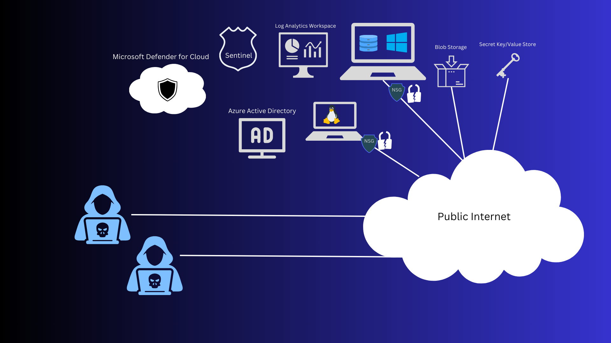

# Azure Honeynet and SOC with Real-World Cyber Attacks

## Objective

In this project, a honeynet was constructed using Microsoft Azure. The objective was to capture and analyze logs from all resources, and consolidate them into a Log Analytics workspace. Microsoft Sentinel was utilized as a SIEM and leverage these logs to develop attack maps, create alerts, and generate security incidents. Azure Sentinel measured insecure environment over a 48-hour period. After that, incidents were dealt with using NIST 800-61 as a guide.  Security controls were implemented to strengthen our virtual environment, using NIST 800-53 as a general guide. Another group of 48-hour metrics were gathered and the results compared. The metrics analyzed were:

- SecurityEvent (Windows Event Logs)
- Syslog (Linux Event Logs)
- SecurityAlert (Log Analytics Alerts Triggered)
- SecurityIncident (Incidents created by Sentinel)
- AzureNetworkAnalytics_CL (Malicious Flows allowed into our honeynet)

## Technologies, Components, and Standards used
- Azure Virtual Network (VNet)
- Azure Network Security Groups (NSG)
- Virtual Machines (1 Windows VM, 1 Linux VM)
- Log Analytics Workspace with KQL Queries
- Azure Key Vault for Secrets Management
- Azure Storage Account for data storage
- Microsoft Sentinel as a Security Information and Event Management system (SIEM)
- Microsoft Defender for Cloud to protect cloud resources
- PowerShell for automation and 
- NIST 800-53 for security controls
- NIST 800-61 for incident handling procedures

## Architecture BEFORE Hardening and Implementing Security Controls

During the "before" stage of the project, and exposed to the public for malicious actors to discover. The goal at this stage was to attract bad actors and observe their attack patterns. To achieve this, A Windows virtual machine hosting a Microsoft SQL database was deployed onto the Windows VM and exposed via the standard port. The Windows and Linux servers both had their network security groups (NSGs) had high priority inbound rules added, allowing all traffic from all ports in any protocol. This is an incredibly dangerous thing to do, but it made for some enticing targets and some great metrics. To entice attackers even more, a storage account and key vault were deployed with public endpoints which were visible on the open internet. The unsecured environment was monitored by Microsoft Sentinel using logs aggregated by the Log Analytics Workspace.

## Architecture AFTER Hardening and Implementing Security Controls

During the "after" stage of the project, the environment was hardened and security controls were implemented in order to satisfy NIST 800-53. These hardening tactics included:
- <b>Network Security Groups (NSGs)</b>: NSGs were hardened by removing the  allow-all inbound traffic rule with a fully restrictive one (the exception of specific public IP addresses that required access to the virtual machines). This ensured that only authorized traffic from a trusted source was allowed to access the virtual machines.

- <b>Built-in Firewalls</b>: Azure's built-in firewalls were configured on the virtual machines to restrict unauthorized access and protect the resources.

- <b>Private Endpoints</b>: To enhance the security of Azure Key Vault and Storage Containers, public endpoints were removed and replaced with private endpoints. This ensured that access to these sensitive resources were limited to the virtual network and not the public internet.

## Attack Maps Before Hardening / Security Controls
<b>This attack map shows the traffic allowed by a Network Security Group with all traffic allowed inbound</b>
 

<b>This attack map shows all the attempts malicious actors attempting to access the Linux virtual machine</b>
 

 <b>This attack map shows all the attempts malicious actors attempting to access the Windows virtual machine</b>
 

## Just Before Hardening
Incidents were dealt with in the manner desrcibed in Nist 800-61. These incidents were investigated, actors tied to other incidents, etc. I also learned that while some actors used tactics resulting in an event ID of 4625 (failed login), some decided to connect from odd ports, resulting in an event ID of 5156. This is done to merely attempt at port scanning, exploit attempts, brute force attempts, malware delivery, etc)

## Metrics Before Hardening / Security Controls
The following table shows the metrics measured within the unsecured environment for 24 hours:
Start Time 2023-08-13 21:03
Stop Time 2023-08-15 21:03

| Metric                   | Count
| ------------------------ | -----
| SecurityEvent            | 431558
| Syslog                   | 121136
| SecurityAlert            | 3
| SecurityIncident         | 385
| AzureNetworkAnalytics_CL | 9808

## Metrics After Hardening / Security Controls

All map queries are non-existent as the queries used in the maps returned no results due to no instances of malicious activity for the 48-hour period after hardening.

The following table shows the metrics measured in the environment for another 48 hours after applying security controls:

Start Time 2023-08-27 21:03
Stop Time 2023-08-29 21:03

| Metric                   | Count
| ------------------------ | -----
| SecurityEvent            | 92155
| Syslog                   | 25
| SecurityAlert            | 0
| SecurityIncident         | 0
| AzureNetworkAnalytics_CL | 0

(If you were wondering why my start time for before metrics and after metrics are quite far apart: 
Hardening was not too long of a process, VMs were left on during this period, but I was preparing to take the CompTIA Security+ and Pentest+ exams, which occupied most of my time, which is why there is such a long pause between the timestamps of the before and after metrics. And yes, I passed both exams, so I am CompTIA certified in Security and Penetration testing!)

## Conclusion

In this project, a small but effective honeynet was constructed in Microsoft Azure, and log sources were aggregated into a Log Analytics workspace. Microsoft Sentinel was configured to trigger alerts and create incidents based on the ingested logs. Additionally, metrics were taken in the unsecured environment before security controls were applied and after implementing security measures. After the implementation of robust security controls, there was a 76.6% reduction in Windows Security Events, a 99.9% reduction in Linux Events, and a 100% reduction in security alerts, incidents, and malicious inbound network traffic. The "Security Posture", as measured by Microsoft Defender for Cloud, was doubled after hardening.
